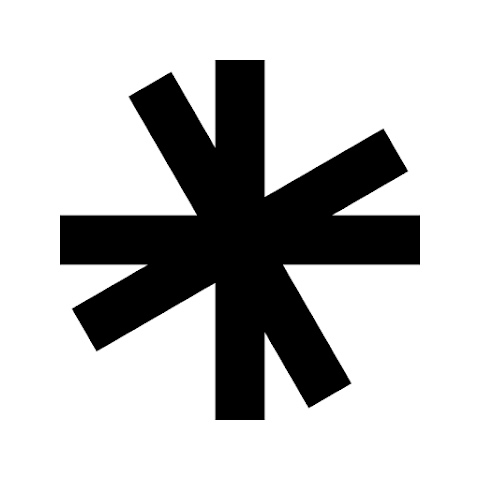
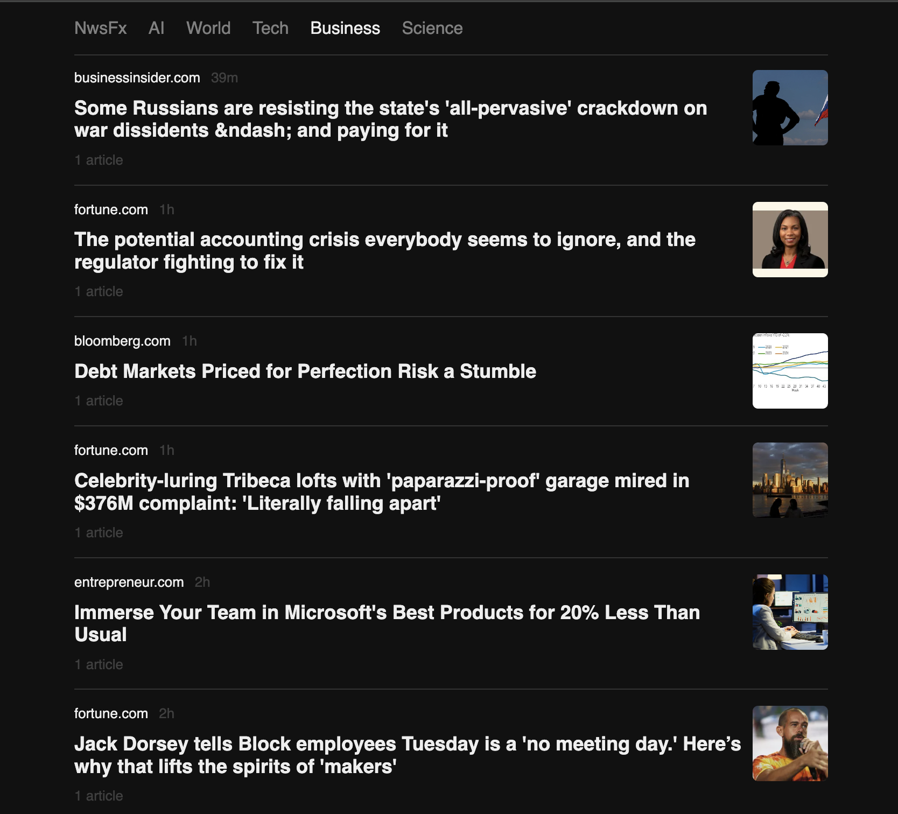

<!-- PROJECT LOGO -->
<br />
<div align="center">
  <a href="https://github.com/fertilisai/nwsfx-server">
    
  </a>

  <h2 align="center">Nwsfx</h2>

  <p align="center">
    A smart news aggregator
  </p>
</div>

<!-- ABOUT THE PROJECT -->

## About The Project

Nwsfx is a simple Artifact clone with curated news sources.



<!-- INSTALLATION -->

## Installation

1. Clone the repos
   ```sh
   git clone https://github.com/fertilisai/nwsfx-server.git
   git clone https://github.com/fertilisai/nwsfx-client.git
   ```
2. Install dependencies
   ```sh
   npm install
   ```
3. Run node
   ```sh
   npm run dev
   ```
4. Run server
   ```sh
   uvicorn main:app --reload
   ```

<!-- FEATURES -->

## Features

- FastAPI backend
- React frontend
- Curated sources
- Curated topics
- Dark mode

<!-- ROADMAP -->

## Roadmap

- [ ] Aggregate similar articles
- [ ] Number of reads
- [ ] Smart recommendations
- [ ] Infinite scroll
- [ ] Card display

<!-- ACKNOWLEDGEMENT -->

## Acknowledgement

- [Artifact](https://artifact.news/)

<!-- LICENSE -->

## License

Distributed under the MIT License. See `LICENSE` for more information.
